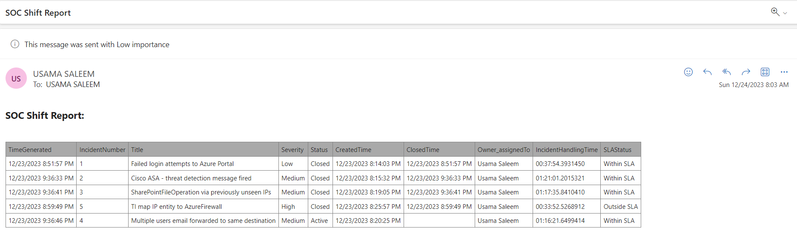

# SOC Shift Email Playbook

This playbook is designed to be triggered automatically every 8 hours when the SOC analyst shift is over. It will provide a comprehensive list of incidents along with their statuses, closure time, and check if any incidents are breaching the SLA (Service Level Agreement).

To simplify the deployment process, you can leverage the convenience of a one-click deployment using the Azure Deploy button:

