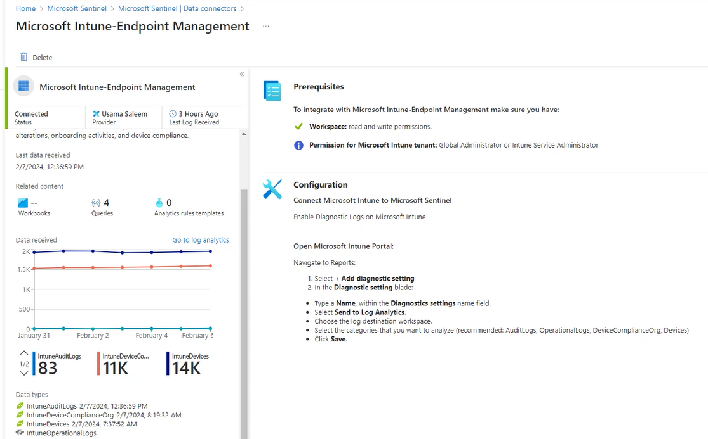

# Microsoft Intune Data Connector

Because Microsoft Sentinel didn't have a built-in way to connect with Microsoft Intune data, I created a custom connector. This makes it much easier to see and track Intune logs in Microsoft Sentinel.

You can set it up effortlessly by clicking just once using the Azure Deploy button.

